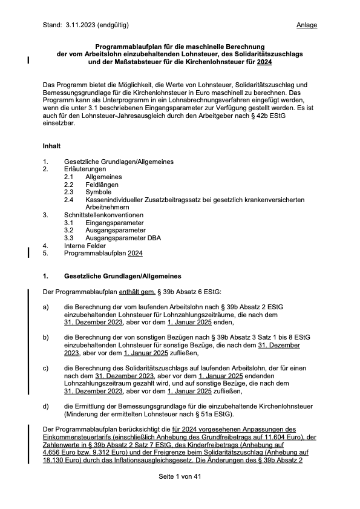

# ``LStXML2Code``

LStXML2Code bringt die XML Programmablaufpläne in eine allgemeine abstrakte Baumstruktur.

## Overview

LStXML2Code ist ein Framework, welches ermöglicht die XML-Programmablaufpläne zu verarbeiten. 

@Image(source:2023-11-03-PAP-2024-anlage-1.png)

## Topics

### Developer

- <doc:GettingStarted>
- <doc:Architecture>
- ``AbstractTreeEncoding``

